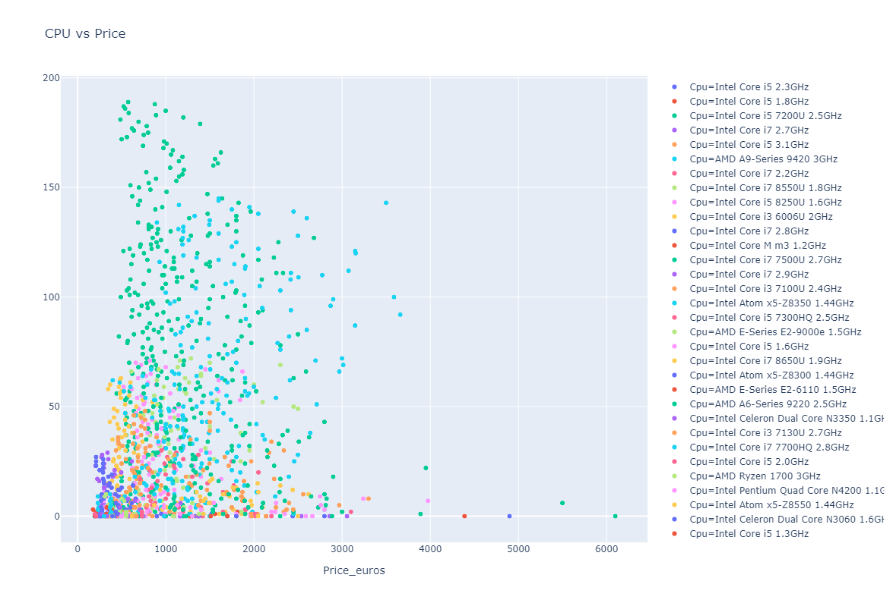

# Laptop-Price-Predicition-

    
  

  
 "The good news about computers is that they do what you tell them to do. The bad news is that they do what you tell them to do." — Ted Nelson
 ----
  
  This a project of "Laptop-Price-Predicition" using 'Machine Learning'algorithms.
  
 A laptop, laptop computer, or notebook computer is a small, portable personal computer (PC) with a screen and alphanumeric keyboard. These typically have a clamshell form factor, typically having the screen mounted on the inside of the upper lid and the keyboard on the inside of the lower lid, although 2-in-1 PCs with a detachable keyboard are often marketed as laptops or as having a laptop mode. Laptops are folded shut for transportation, and thus are suitable for mobile use. Its name comes from the lap, as it was deemed practical to be placed on a person’s lap when being used. Today, laptops are used in a variety of settings, such as at work, in education, for playing games, web browsing, for personal multimedia, and general home computer use.
 
 GOAL:
 ----
 Minimize the "loss error".

Analysis:
-----
Here we use plotly for analysis.

1.**Bar Plot on Distribution of Companies of Laptop:**

We can see that the distribution of Lenovo, Dell, HP laptops are almost. It means that those are the highest selling laptops currently.

2.**The histogram on Ram vs Price in Euros:**

3.**Scatter Plot on RAM vs Price vs Company:**

The memory size is inversely proportional with the price of euros and the selling rate of higher price laptops is very less.

4.**Scatter Plot on CPU vs Price vs Company:**

The generation of the processor is proportional to the price. Laptops with Intel, AMD processors are the highest selling laptops here.

5.**Bar Plot on Distribution of Operating Systems of Laptop:**

6.**Pie Chart on Company vs Operating System vs Price:**

7.**Scatter Plot on Company vs Ram vs Operating System vs Price vs CPU vs Memory:**

This a moving graph but due to some unavoidable circumstances moving graph is not able to upload.

Machine Learning Algorithms:
-----
**Linear Regression:**

Linear Regression is a machine learning algorithm based on supervised learning. It performs a regression task. Regression models a target prediction value based on independent variables. It is mostly used for finding out the relationship between variables and forecasting. Different regression models differ based on — the kind of relationship between dependent and independent variables, they are considering and the number of independent variables being used.

Linear regression performs the task to predict a dependent variable value (y) based on a given independent variable (x). So, this regression technique finds out a linear relationship between x (input) and y(output). Hence, the name is Linear Regression. y=ax+c

    
  

  
 **Random Forest:**
 
Random forests or random decision forests are an ensemble learning method for classification, regression, and other tasks that operates by constructing a multitude of decision trees at training time. For classification tasks, the output of the random forest is the class selected by most trees. For regression tasks, the mean or average prediction of the individual trees is returned. Random decision forests correct for decision trees’ habit of overfitting to their training set 587–588 Random forests generally outperform decision trees, but their accuracy is lower than gradient boosted trees. However, data characteristics can affect their performance.

    
  

**Decision Tree:**

A decision tree is a decision support tool that uses a tree-like model of decisions and their possible consequences, including chance event outcomes, resource costs, and utility. It is one way to display an algorithm that only contains conditional control statements.

Decision trees are commonly used in operations research, specifically in decision analysis, to help identify a strategy most likely to reach a goal, but are also a popular tool in machine learning.

A decision tree is a flowchart-like structure in which each internal node represents a “test” on an attribute (e.g. whether a coin flip comes up heads or tails), each branch represents the outcome of the test, and each leaf node represents a class label (decision taken after computing all attributes). The paths from the root to the leaf represent classification rules.

    
  

**Support Vector Regression Model:**

In machine learning, support vector machines (SVMs, also support vector networks) are supervised learning models with associated learning algorithms that analyze data for classification and regression analysis. Developed at AT&T Bell Laboratories by Vladimir Vapnik with colleagues (Boser et al., 1992, Guyon et al., 1993, Vapnik et al., 1997) SVMs are one of the most robust prediction methods, is based on statistical learning frameworks or VC theory proposed by Vapnik (1982, 1995) and Chervonenkis (1974). Given a set of training examples, each marked as belonging to one of two categories, an SVM training algorithm builds a model that assigns new examples to one category or the other, making it a non-probabilistic binary linear classifier (although methods such as Platt scaling exist to use SVM in a probabilistic classification setting). SVM maps training examples to points in space so as to maximize the width of the gap between the two categories. New examples are then mapped into that same space and predicted to belong to a category based on which side of the gap they fall.

In addition to performing linear classification, SVMs can efficiently perform a non-linear classification using what is called the kernel trick, implicitly mapping their inputs into high-dimensional feature spaces.

When data are unlabelled, supervised learning is not possible, and an unsupervised learning approach is required, which attempts to find natural clustering of the data to groups, and then map new data to these formed groups. The support-vector clustering algorithm, created by Hava Siegelmann and Vladimir Vapnik, applies the statistics of support vectors, developed in the support vector machines algorithm, to categorize unlabeled data, and is one of the most widely used clustering algorithms in industrial applications.

    
  

DEVELOPERS
------
<!--

    <a href="https://www.linkedin.com/in/soham-nandi-b39288215/" target="_blank"><u>Soham Nandi</u></a>
<a href="https://www.linkedin.com/in/pinaki-subhra-bhattacharya-1a6566217/" target="_blank"><u>Pinaki Subhra Bhattacharya </u></a>  

-->

 

 

Blog:
----

Check out the Medium article ,where Pinaki have explained in detail.

[Blog Link](https://medium.com/analytics-vidhya/laptop-price-prediction-by-machine-learning-7e1211bb96d1)

THANK YOU
-----
